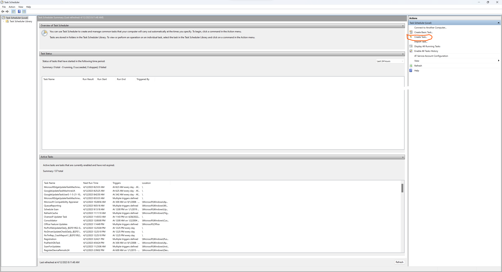
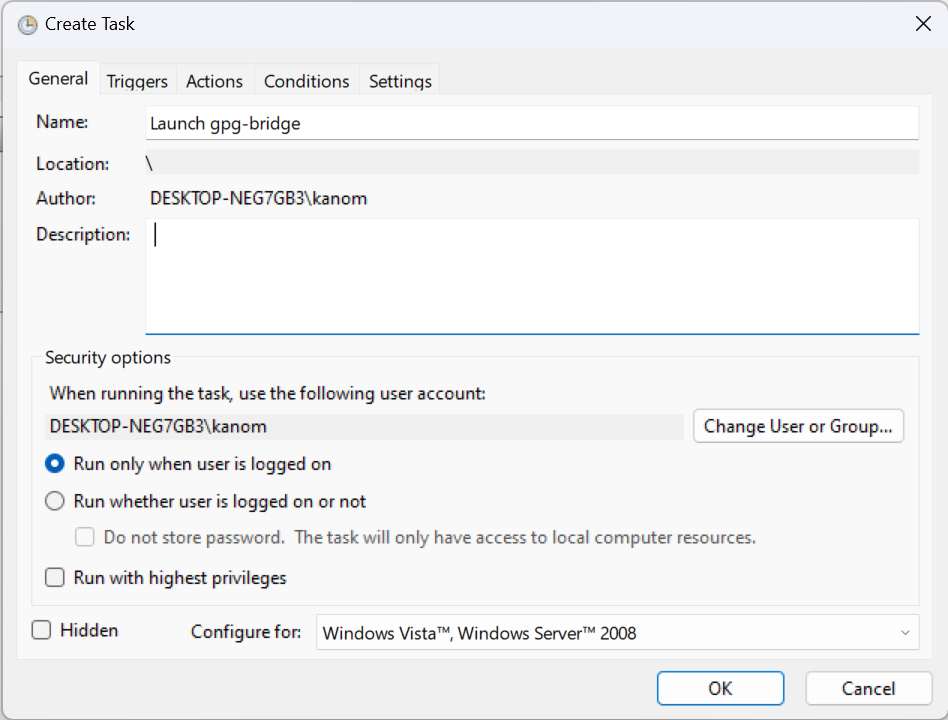
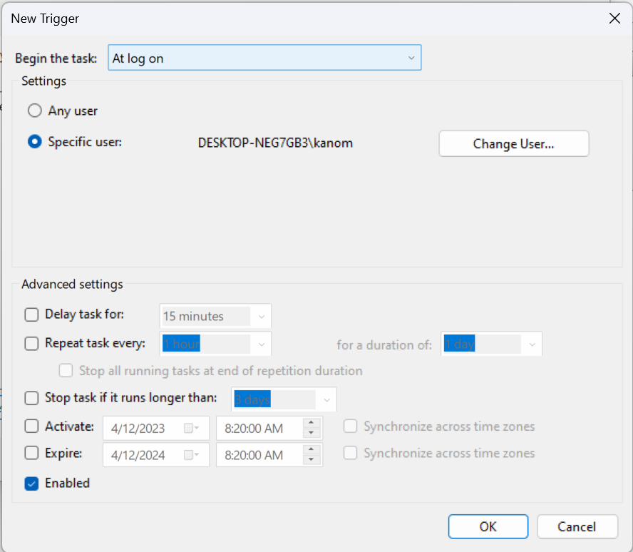
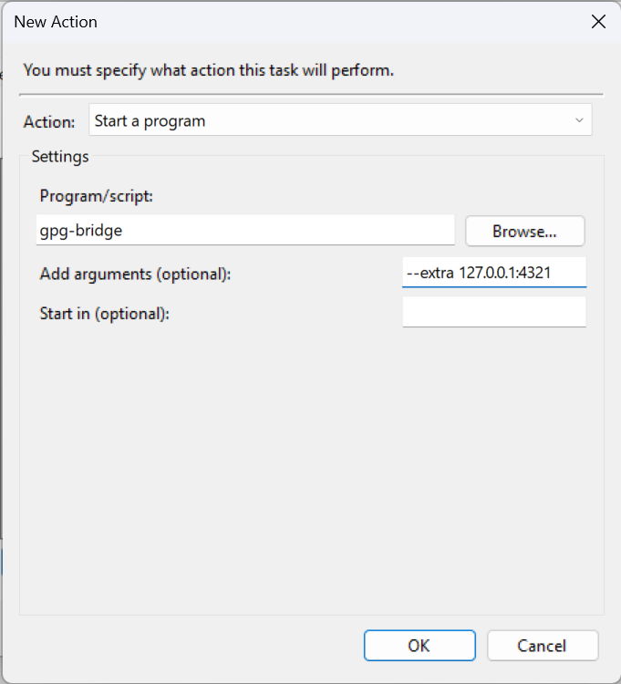

# Installation

1\. Install it on your system.

```sh
cargo install gpg-bridge
```

2\. Auto-launch it at login.

gpg-bridge can be automatically launched using the `Task Scheduler(taskschd.msc)`.









This way, gpg-bridge will be started automatically when a user logs in.
